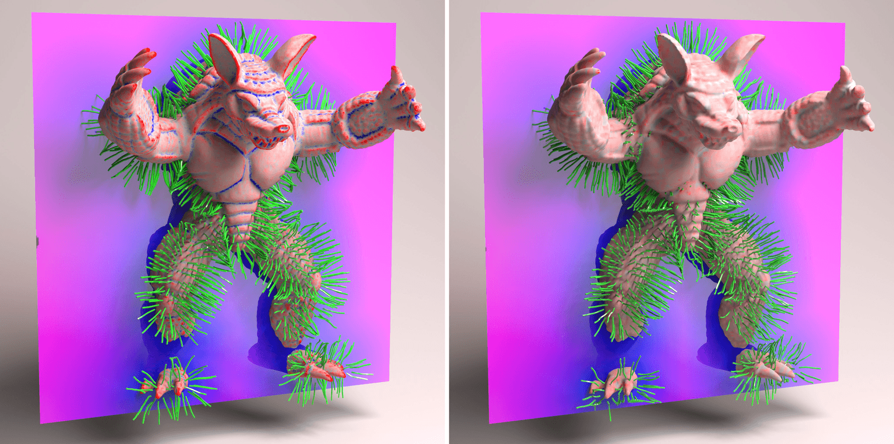
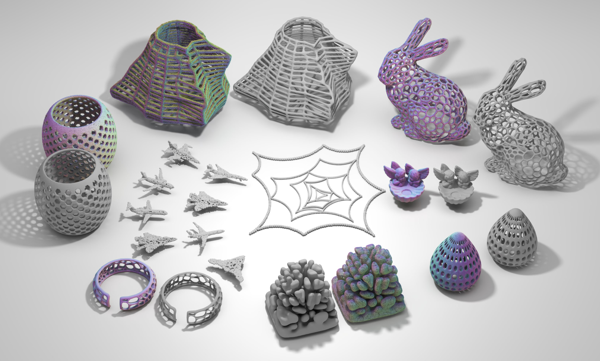
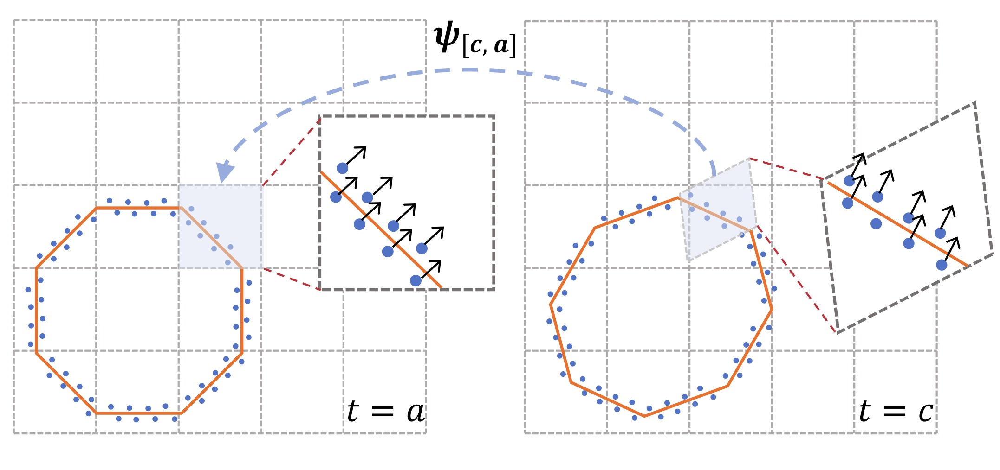



# Research

<!-- New style rendering if publication categories are defined -->
<!-- 
  
 -->

  

    

      

        
      

      

        <b>Hermite-NGP: Gradient-Augmented Hash Encoding for Learning PDEs</b> 
        <i>ICML 2026</i> 
        <b>Jinjin He</b>, Zhiqi Li, Sinan Wang, Bo Zhu 
        <a nonsmooth="1" href="https://openreview.net/pdf?id=YJsolh0zg1" class="">Paper</a>
        <a nonsmooth="1" href="../hermite-ngp/" class="">Project Page</a>
      

    

  

  

    

      

        
      

      

        <b>Trajectory Consistency for One-Step Generation on Euler Mean Flows</b> 
        <i>ICML 2026</i> 
        Zhiqi Li, Yuchen Sun, Duowen Chen, <b>Jinjin He</b>, Bo Zhu 
        <a nonsmooth="1" href="https://arxiv.org/pdf/2602.02571" class="">Paper</a>
        <a nonsmooth="1" href="https://zhiqili-cg.github.io/EulerMeanFlow_project/" class="">Project Page</a>
      

    

  

  

    

      

        
      

      

        <b>Generative Modeling with Orbit-Space Particle Flow Matching</b> 
        <i>SIGGRAPH 2026 (ACM Transactions on Graphics)</i> 
        Sinan Wang*, <b>Jinjin He</b>*, Shenyifan Lu, Ruicheng Wang, Greg Turk, Bo Zhu(* co-first author) 
        <a nonsmooth="1" href="../files/OGPP.pdf" class="">Paper</a>
        <a nonsmooth="1" href="https://ogpp.sinanw.com/" class="">Project Page</a>
      

    

  

  

    

      

        
      

      

        <b>A Level Set Method on Particle Flow Maps</b> 
        <i>Arxiv</i> 
        <b>Jinjin He</b>, Taiyuan Zhang, Zhiqi Li, Junwei Zhou, Duowen Chen, Bo Zhu 
        <a nonsmooth="1" href="https://arxiv.org/pdf/2601.09939" class="">Paper</a>
        <!-- <a nonsmooth="1" href="https://pearseven.github.io/DiffFMProject/" class="">Project Page</a> -->
      

    

  

  

    

      

        
      

      

        <b>An Adjoint Method for Differentiable Fluid Simulation on Flow Maps</b> 
        <i>SIGGRAPH Asia 2025</i> 
        Zhiqi Li*, <b>Jinjin He*</b>, Barnabás Börcsök, Taiyuan Zhang, Duowen Chen, Tao Du, Ming Lin, Greg Turk, Bo Zhu (* co-first author) 
        <a nonsmooth="1" href="../files/SIGA_2025__Differentiable_Flow_Map_Upload.pdf" class="">Paper</a>
        <a nonsmooth="1" href="https://pearseven.github.io/DiffFMProject/" class="">Project Page</a>
      

    

  

  

    

      

        
      

      

        <b>Fluid Simulation on Compressible Flow Maps</b> 
        <i>ACM Transactions on Graphics (SIGGRAPH 2025)</i> 
        Duowen Chen*, Zhiqi Li*, Taiyuan Zhang, <b>Jinjin He</b>, Junwei Zhou, Bart G van Bloemen Waanders, Bo Zhu(* co-first author) 
        <a nonsmooth="1" href="https://cdwj.github.io/projects/compressible-flowmap-project-page/static/pdfs/SIG_2025__Compressible_Flow_Map_Upload.pdf" class="">Paper</a>
        <a nonsmooth="1" href="https://cdwj.github.io/projects/compressible-flowmap-project-page/index.html" class="">Project Page</a>
      

    

  

  

    

      

        
      

      

        <b>Multi-level Partition of Unity on Differentiable Moving Particles</b> 
        <i>ACM Transactions on Graphics (SIGGRAPH Asia 2024)</i> 
        <b>Jinjin He</b>, Taiyuan Zhang, Hiroki Kobayashi, Atsushi Kawamoto, Yuqing Zhou, Tsuyoshi Nomura, Bo Zhu 
        <a nonsmooth="1" href="../files/diffmpu/SASIA_2024__Particle_PU (5).pdf" class="">Paper</a>
        <a nonsmooth="1" href="https://jinjinhe2001.github.io/diffmpu-page/index.html" class="">Project Page</a>
      

    

  

