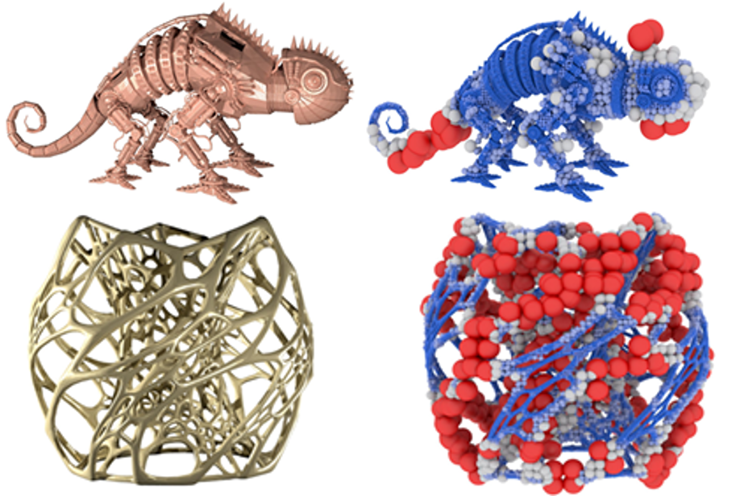



<!-- New style rendering if publication categories are defined -->
<!-- 
  
 -->

  

    

      

        
      

      

        <b>Multi-level Partition of Unity on Differentiable Moving Particles</b> 
        <i>ACM Transactions on Graphics (SIGGRAPH ASIA 2024)</i> 
        <b>Jinjin He</b>, Taiyuan Zhang, Hiroki Kobayashi, Atsushi Kawamoto, Yuqing Zhou, Tsuyoshi Nomura, Bo Zhu 
        <a nonsmooth="1" href="../files/diffmpu/SASIA_2024__Particle_PU (5).pdf" class="">Paper</a>
        <a nonsmooth="1" href="https://jinjinhe2001.github.io/diffmpu-page/index.html" class="">Project Page</a>
      

    

  

