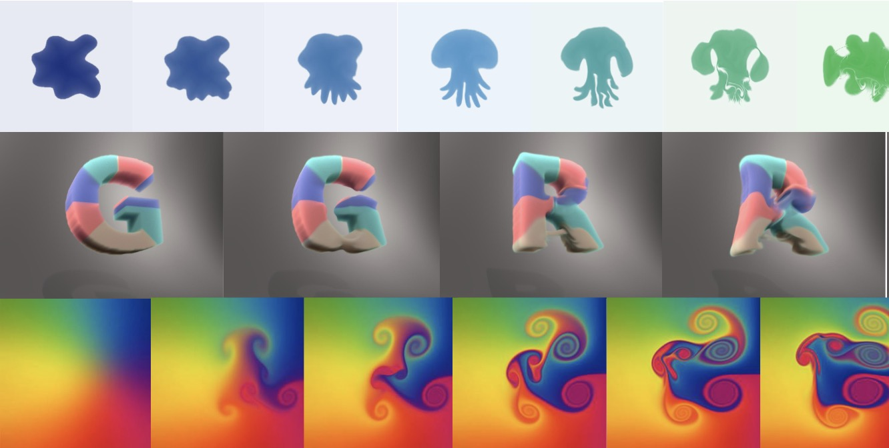
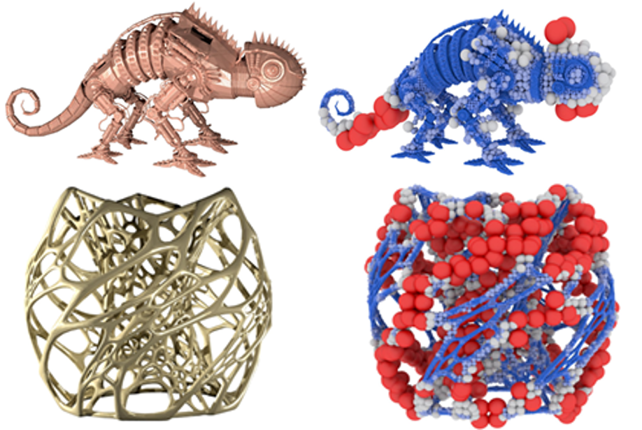

Hi! I am currently a Ph.D. student at Georgia Tech, majoring in Computer Science, advised by Prof. [Bo Zhu](https://faculty.cc.gatech.edu/~bozhu/) in Visual Computing Lab.

## Research 

  

    

      

        
      

      

        <b>An Adjoint Method for Differentiable Fluid Simulation on Flow Maps</b> 
        <i>SIGGRAPH Asia 2025</i> 
        Zhiqi Li*, <b>Jinjin He*</b>, Barnabás Börcsök, Taiyuan Zhang, Duowen Chen, Tao Du, Ming Lin, Greg Turk, Bo Zhu (* co-first author) 
        <a nonsmooth="1" href="../files/SIGA_2025__Differentiable_Flow_Map_Upload.pdf" class="">Paper</a>
      

    

  

  

    

      

        
      

      

        <b>Fluid Simulation on Compressible Flow Maps</b> 
        <i>ACM Transactions on Graphics (SIGGRAPH 2025)</i> 
        Duowen Chen*, Zhiqi Li*, Taiyuan Zhang, <b>Jinjin He</b>, Junwei Zhou, Bart G van Bloemen Waanders, Bo Zhu(* co-first author) 
        <a nonsmooth="1" href="https://cdwj.github.io/projects/compressible-flowmap-project-page/static/pdfs/SIG_2025__Compressible_Flow_Map_Upload.pdf" class="">Paper</a>
        <a nonsmooth="1" href="https://cdwj.github.io/projects/compressible-flowmap-project-page/static/pdfs/SIG_2025__Compressible_Flow_Map_Upload.pdf" class="">Project Page</a>
      

    

  

  

    

      

        
      

      

        <b>Multi-level Partition of Unity on Differentiable Moving Particles</b> 
        <i>ACM Transactions on Graphics (SIGGRAPH Asia 2024)</i> 
        <b>Jinjin He</b>, Taiyuan Zhang, Hiroki Kobayashi, Atsushi Kawamoto, Yuqing Zhou, Tsuyoshi Nomura, Bo Zhu 
        <a nonsmooth="1" href="../files/diffmpu/SASIA_2024__Particle_PU (5).pdf" class="">Paper</a>
        <a nonsmooth="1" href="https://jinjinhe2001.github.io/diffmpu-page/index.html" class="">Project Page</a>
      

    

  

## Projects
I’ve worked on a range of projects, from computer graphics and game development to compilers and more. Check out [Projects](https://jinjinhe2001.github.io/projects/) to explore more my works in detail.

